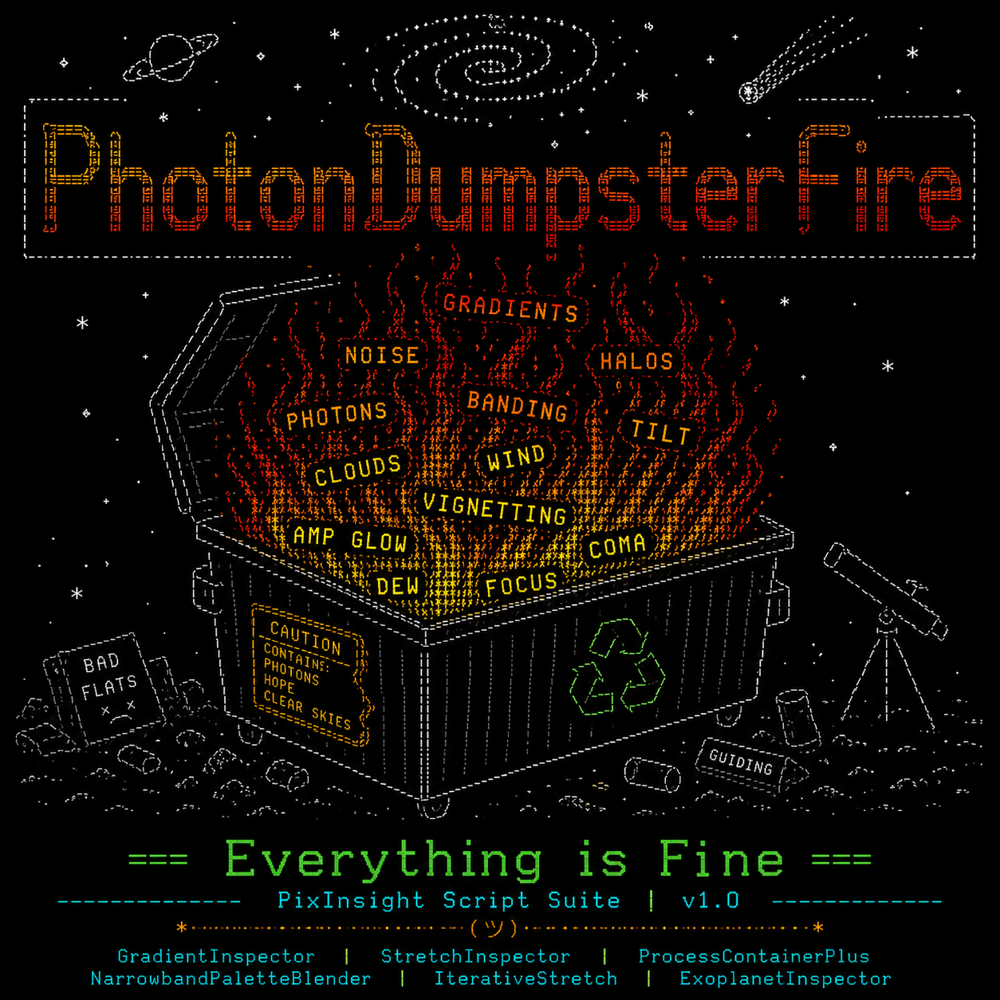

# PhotonDumpsterFire



PixInsight astrophotography utilities and workflow tools.

**Everything is Fine.**

PhotonDumpsterFire is a collection of PixInsight scripts focused on astrophotography analysis, workflow enhancement, image inspection, and image processing. These tools were developed to solve real-world astrophotography problems encountered during data acquisition and processing.

---

# Installation

## Recommended: PixInsight Update Repository

PhotonDumpsterFire can be installed and updated directly through the PixInsight Update System.

1. Open PixInsight.
2. Select **Resources → Updates → Manage Repositories**.
3. Click **Add**.
4. Enter the following repository URL:

```text
https://raw.githubusercontent.com/brannonq/PhotonDumpsterFire/main/
```

5. Click **OK**.
6. Click **Check for Updates**.
7. Select **PhotonDumpsterFire** from the available packages list.
8. If PixInsight warns that the repository is unsigned, click **Yes** to continue.
9. Click **Apply**.
10. Restart PixInsight when prompted.

Future updates can be installed directly through the PixInsight Update System.

---

## Manual Installation

1. Download the latest release ZIP file.
2. Extract the archive.
3. Open PixInsight.
4. Select **Script → Feature Scripts**.
5. Click **Add**.
6. Browse to:

```text
src/scripts/PhotonDumpsterFire
```

7. Click **OK**.
8. Restart PixInsight.

---

# Included Scripts

## GradientInspector

Runs up to five gradient removal tools side by side and displays a comparison mosaic. Pick the winner and apply it in one click.

## StretchInspector

Compares six stretch methods on the same image in a single mosaic. See how different stretching methods handle your data before committing.

## ProcessContainerPlus

Full linear batch processing pipeline in one script. Gradient removal, stretch tool selection, and star recombination with configurable options per run.

## NarrowbandPaletteBlender

SHO and HOO palette blending with real-time zoom and pan preview. Dial in your narrowband mix before applying.

## IterativeStretch

Progressive multi-pass Histogram Transoformation stretch with per-pass intensity stepping. Mimics a manual GHS workflow automatically. Includes Stars Only mode for star-extracted images.

## ExoplanetInspector

Currently under development. Find exoplanet hosting stars from your image and generate light curves.

---

# Repository

GitHub Repository:

https://github.com/brannonq/PhotonDumpsterFire

PixInsight Update Repository:

```text
https://raw.githubusercontent.com/brannonq/PhotonDumpsterFire/main/
```

---

# License

MIT License.

---

